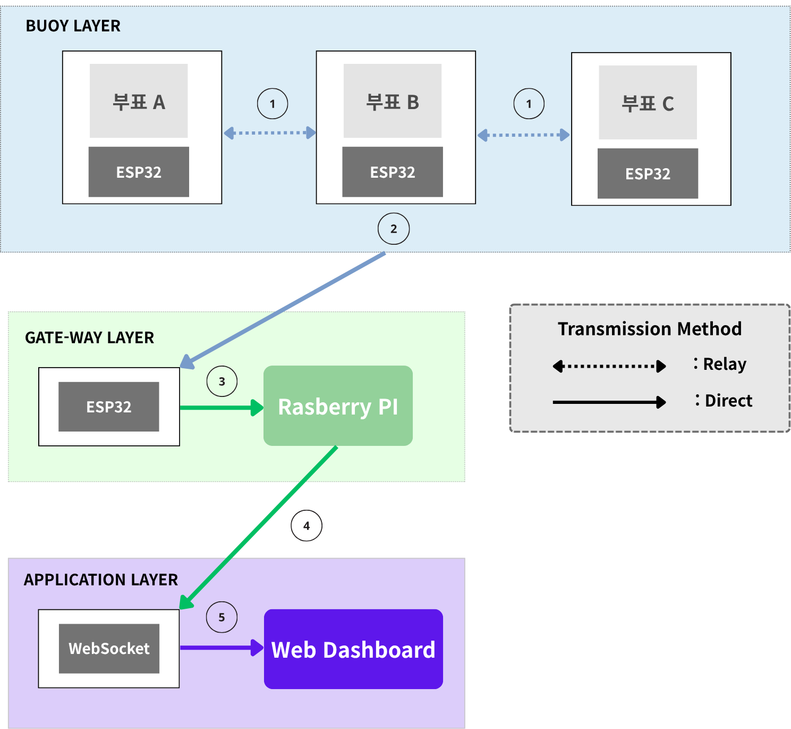
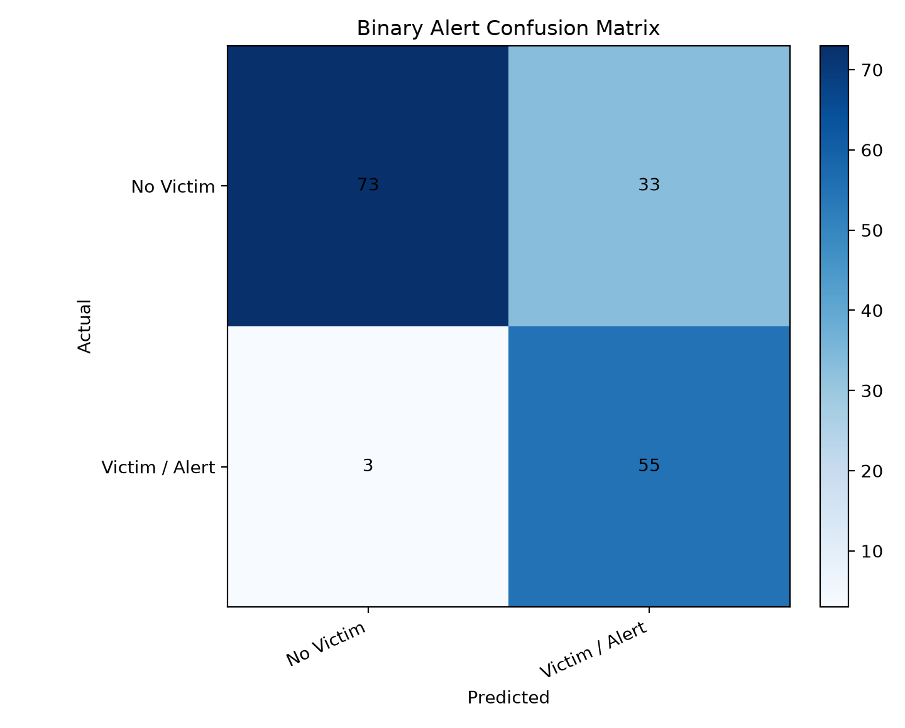

# LoRa 경량 Pub/Sub 기반 해양 익수자 탐지 시스템

LoRa 물리 계층 위에 TCP와 중앙 broker 없이 동작하는 경량 pub/sub 프로토콜을 직접 설계하고, 부표 센서 데이터와 Raspberry Pi 대시보드를 연결해 위험 수면 교란을 실시간으로 표시하는 IoT 실습 최종 프로젝트입니다.

## 팀 정보

| 항목 | 내용 |
| --- | --- |
| 과목 | ECE40066-01 IoT 실습 |
| 팀 | Team 02 |
| 프로젝트명 | LoRa 경량 Pub/Sub 프로토콜 기반의 해양 익수자 탐지 시스템 |
| 발표일 | 2026-06-18 |

| 학번 | 이름 |
| --- | --- |
| 21900103 | 김민혁 |
| 21900320 | 추인규 |
| 22100467 | 권혁민 |

## 프로젝트 개요

해수욕장, 호수, 항만처럼 WiFi나 셀룰러 인프라가 부족한 수면 환경에서는 원거리 상시 감시가 어렵습니다. 이 프로젝트는 초음파 센서와 가속도 센서를 탑재한 부표 여러 개를 배치하고, 부표가 감지한 위험 수면 교란을 LoRa 멀티홉으로 Raspberry Pi 수신국까지 전달합니다.

핵심 목표는 기성 MQTT broker를 사용하는 것이 아니라, LoRa의 64 bytes FIFO 제약과 TCP 부재를 고려해 MQTT의 pub/sub 개념을 직접 재설계하는 것입니다. TTGO LoRa32 펌웨어는 PlatformIO 기반으로 빌드/업로드합니다.

## 핵심 기능

- TTGO LoRa32 기반 부표 노드에서 sonar, IMU 센서 샘플 수집
- PlatformIO 기반 ESP32 펌웨어 빌드, 업로드, native 단위 테스트
- LoRa 위에서 동작하는 최대 11 bytes 경량 pub/sub 패킷 구현
- TTL과 `(node_id, msg_id)` 기반 멀티홉 relay 및 중복 억제
- Raspberry Pi 게이트웨이에서 Serial 수신, broker dispatch, HTTP forward 처리
- FastAPI와 WebSocket 기반 실시간 부표 상태 대시보드
- scikit-learn 기반 위험 수면 교란 분류 실험 및 대시보드 연동

## 시스템 아키텍처



## 데이터 흐름

1. 부표가 sonar, IMU 값을 읽고 LoRa `PUBLISH` 패킷을 전송합니다.
2. 중간 부표는 TTL을 감소시키며 `RELAY`하고, 이미 본 `(node_id, msg_id)`는 버립니다.
3. 게이트웨이 TTGO는 LoRa 패킷을 수신하고 CRC 검증 후 ACK를 송신합니다.
4. Raspberry Pi의 `serial_reader`가 binary Serial 데이터를 파싱해 broker로 전달합니다.
5. broker가 서버의 `/api/packet`으로 HTTP POST를 보내고, 서버가 상태와 이벤트를 갱신합니다.
6. FastAPI 서버가 WebSocket으로 대시보드에 실시간 상태를 push합니다.

## LoRa 패킷 포맷

PRD 초기안보다 더 작은 고정 토픽 구조로 확정했습니다.

```text
[preamble(1) | msg_type(1) | node_id(1) | msg_id(1) | ttl(1) | topic(1) | pld_len(1) | payload(0-3) | crc8(1)]
```

- 최대 길이: 11 bytes
- `preamble`: `0xAB`
- `msg_type`: `PUBLISH`, `SUBSCRIBE`, `ACK`, `RELAY`
- `topic`: `ALERT`, `HEARTBEAT`, `SENSOR_RAW`, `CMD_*`
- `ttl`: 멀티홉 relay 무한 전파 방지
- `crc8`: 깨진 패킷 필터링

## 디렉토리 구조

| 경로 | 설명 |
| --- | --- |
| [`LoRa_firmware`](./LoRa_firmware) | TTGO LoRa32 부표 펌웨어, 게이트웨이 펌웨어, LoRaPubSub 라이브러리 |
| [`rpi-gateway-server`](./rpi-gateway-server) | Raspberry Pi Serial gateway, broker, FastAPI 서버, WebSocket 대시보드 |
| [`detection_ml_v1`](./detection_ml_v1) | 센서 CSV 수집, 라벨 데이터 준비, scikit-learn 학습/평가 |
| [`docs`](./docs) | 탐지 알고리즘 설계 문서와 설명용 그래프 |
| [`PRD.md`](./PRD.md) | 프로젝트 요구사항, 제약사항, 구현 현황 정리 |

## PlatformIO 설치 및 사용

이 프로젝트의 `LoRa_firmware`는 PlatformIO 프로젝트입니다. `platformio.ini`에서 TTGO LoRa32 부표 펌웨어, 게이트웨이 펌웨어, native 테스트 환경을 나누어 관리합니다.

설치 방법은 둘 중 편한 방식을 사용합니다.

```bash
# macOS Homebrew
brew install platformio

# 또는 Python pip
python3 -m pip install -U platformio

# 설치 확인
pio --version
```

VS Code를 사용한다면 Extension에서 `PlatformIO IDE`를 설치해도 됩니다. 이 경우 PlatformIO Core가 IDE에 포함되어 있고, PlatformIO 터미널에서 `pio` 명령을 사용할 수 있습니다.

자주 쓰는 명령:

```bash
cd LoRa_firmware

# 부표 펌웨어 빌드
pio run -e ttgo-lora32-v21

# 부표 펌웨어 업로드
pio run -e ttgo-lora32-v21 --target upload

# 게이트웨이 TTGO 펌웨어 업로드
pio run -e gateway --target upload

# Serial monitor
pio device monitor -b 115200

# LoRaPubSub native 테스트
pio test -e native
```

## 빠른 실행

### 1. 부표 펌웨어 빌드

```bash
cd LoRa_firmware
pio run -e ttgo-lora32-v21
pio run -e ttgo-lora32-v21 --target upload
pio device monitor -b 115200
```

게이트웨이 TTGO에는 별도 엔트리를 업로드합니다.

```bash
cd LoRa_firmware
pio run -e gateway --target upload
```

### 2. Raspberry Pi 게이트웨이/서버 실행

```bash
cd rpi-gateway-server
chmod +x setup.sh run.sh
./setup.sh
SERIAL_PORT=/dev/ttyACM0 MOCK_DATA=0 ./run.sh
```

대시보드 접속:

```text
http://localhost:8000
```

하드웨어 없이 UI만 확인할 때는 mock data를 켭니다.

```bash
cd rpi-gateway-server
MOCK_DATA=1 ./run.sh
```

### 3. ML 학습/평가

```bash
pip install -r detection_ml_v1/requirements.txt
python detection_ml_v1/train.py --csv detection_ml_v1/example_data/bath_accel_labeled_v2.csv --output-dir detection_ml_v1/artifacts/bath_accel_only_v2
python detection_ml_v1/evaluate_test_set.py
```

현재 서버 기본 모델 경로는 다음과 같습니다.

```text
detection_ml_v1/models/bath_accel_only_v2/model.joblib
```

## ML 평가 결과 예시

`detection_ml_v1/artifacts/test_set_eval_v1`에 테스트셋 평가 결과와 그래프가 저장되어 있습니다.

- Binary alert accuracy: `0.7805`
- Binary alert recall: `0.9483`
- False negative rate: `0.0517`
- Multiclass weighted F1: `0.7502`



## 테스트

```bash
cd LoRa_firmware
pio test -e native

cd ../rpi-gateway-server
source .venv/bin/activate
python -m pytest tests

cd ../detection_ml_v1
python -m pytest tests
```

## 참고 문서

- [PRD](./PRD.md)
- [탐지 알고리즘 설계](./docs/DETECTION_ALGORITHM_DESIGN.md)
- [LoRa 펌웨어 README](./LoRa_firmware/README.md)
- [RPi 게이트웨이/서버 README](./rpi-gateway-server/README.md)
- [Detection ML README](./detection_ml_v1/README.md)
