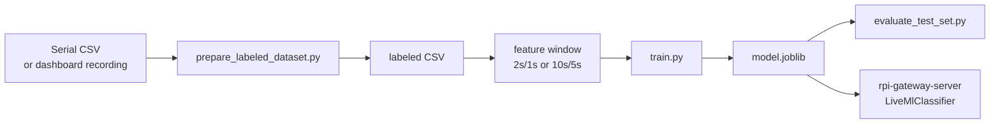
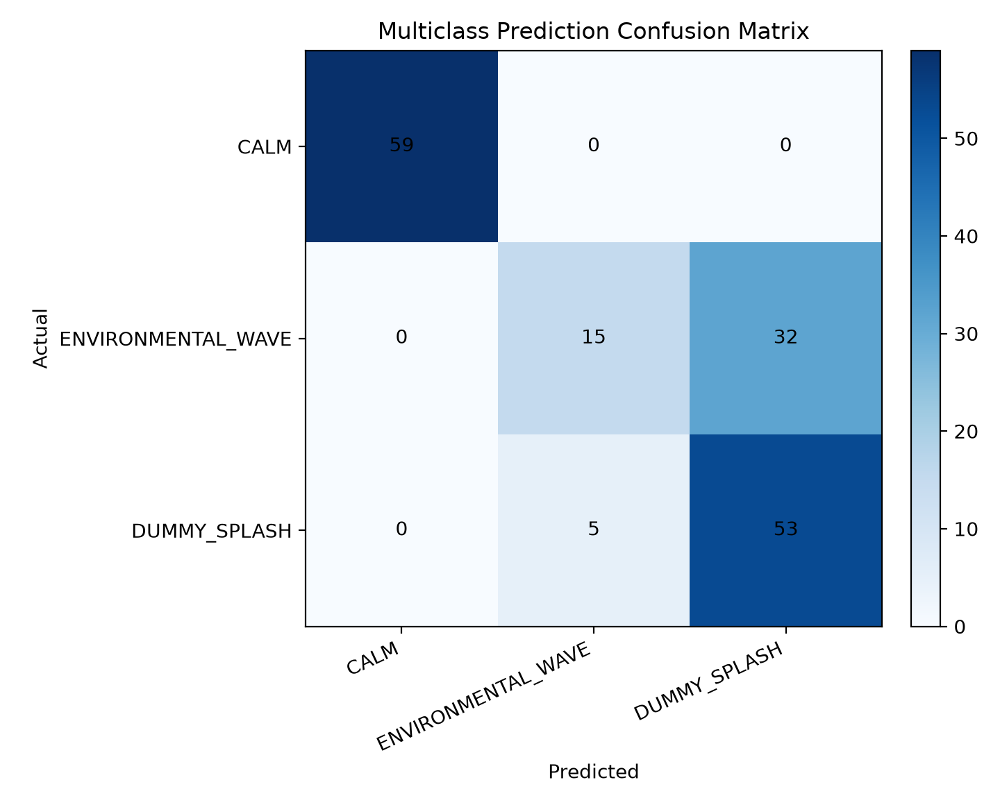
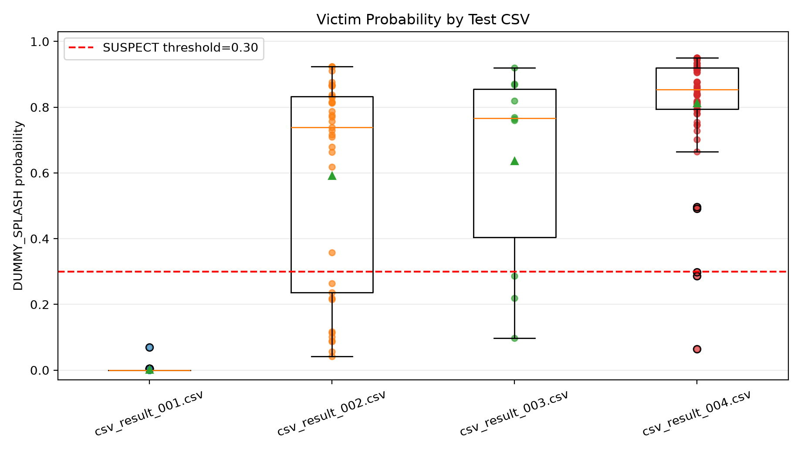

# Detection ML v1

부표에서 수집한 sonar, IMU CSV를 기반으로 위험 수면 교란을 분류하는 scikit-learn 실험 폴더입니다. 학습된 모델은 `rpi-gateway-server`의 FastAPI 서버에서 실시간 packet window에 적용됩니다.

## 목표

- `CALM`, `ENVIRONMENTAL_WAVE`, `DUMMY_SPLASH`, `SENSOR_FAULT` 라벨 데이터 준비
- sensor raw CSV를 일정 window feature로 변환
- 후보 classifier를 비교해 `model.joblib` 저장
- 대시보드에서는 복잡한 라벨을 `NORMAL`, `SUSPECT`, `ALERT` 상태로 단순화

## 데이터 흐름



## 라벨

| Label | 의미 | 처리 |
| --- | --- | --- |
| `CALM` | 정수면 또는 작은 정상 흔들림 | 정상 |
| `ENVIRONMENTAL_WAVE` | 부표 전체가 함께 흔들리는 환경 파동 | 정상 또는 주의 |
| `DUMMY_SPLASH` | 인형 첨벙임으로 만든 국소 위험 교란 | `SUSPECT` 후보 |
| `SENSOR_FAULT` | timeout, 비정상 값, 측정 실패 | rule-based로 우선 분리 |

현재 웹 서버 표시는 단순화되어 있습니다.

- `CALM`, `ENVIRONMENTAL_WAVE`: `NORMAL`
- `DUMMY_SPLASH`: `SUSPECT`
- `sonar_cm <= SONAR_DISTANCE_THRESHOLD_CM`: rule-based `SUSPECT`

## 입력 CSV

필수 열:

```csv
timestamp_ms,buoy_id,sonar_cm,accel_mag_ms2,label
0,A,82.1,9.80,CALM
100,A,82.0,9.82,CALM
```

선택 열:

- `sonar_valid`
- `sonar_timeout`

예측용 CSV에는 `label`이 없어도 됩니다.

## 주요 feature

기본 window는 샘플 간격에 따라 자동 선택됩니다.

- 빠른 Serial CSV: 2초 window, 1초 stride
- sparse LoRa CSV: 10초 window, 5초 stride

현재 `bath_accel_only_v2` 모델의 주요 입력은 accel 중심 feature입니다.

```text
accel_z
accel_mean_ms2
accel_rms_2s
accel_range_2s
accel_jerk_2s
```

sonar는 ML 입력보다 서버의 rule-based 근접 조건으로 분리해 사용합니다.

## 설치

```bash
pip install -r detection_ml_v1/requirements.txt
```

## 학습

합성 데이터 예시:

```bash
python detection_ml_v1/generate_synthetic_data.py
python detection_ml_v1/train.py --csv detection_ml_v1/example_data/synthetic_measurements.csv
```

욕조 실험 accel-only v2 모델 학습:

```bash
python detection_ml_v1/prepare_labeled_dataset.py \
  --run detection_ml_v1/tests/csv_result_002_idle.csv=CALM \
  --run detection_ml_v1/tests/csv_result_003_wave.csv=ENVIRONMENTAL_WAVE \
  --run detection_ml_v1/tests/csv_result_004_victim.csv=DUMMY_SPLASH \
  --run detection_ml_v1/tests/csv_result_005.csv=CALM \
  --run detection_ml_v1/tests/csv_result_006.csv=ENVIRONMENTAL_WAVE \
  --run detection_ml_v1/tests/csv_result_007.csv=DUMMY_SPLASH \
  --trim-start-seconds 5 \
  --trim-end-seconds 2 \
  --output detection_ml_v1/example_data/bath_accel_labeled_v2.csv

python detection_ml_v1/train.py \
  --csv detection_ml_v1/example_data/bath_accel_labeled_v2.csv \
  --output-dir detection_ml_v1/artifacts/bath_accel_only_v2
```

생성 결과:

```text
detection_ml_v1/artifacts/bath_accel_only_v2/feature_windows.csv
detection_ml_v1/artifacts/bath_accel_only_v2/metrics.csv
detection_ml_v1/artifacts/bath_accel_only_v2/model.joblib
detection_ml_v1/artifacts/bath_accel_only_v2/predictions.csv
```

## 예측

```bash
python detection_ml_v1/predict.py \
  --csv detection_ml_v1/example_data/bath_accel_labeled_v2.csv \
  --model detection_ml_v1/artifacts/bath_accel_only_v2/model.joblib \
  --output detection_ml_v1/artifacts/bath_accel_only_v2/predictions.csv
```

## 테스트셋 평가

```bash
python detection_ml_v1/evaluate_test_set.py
```

기본 출력 경로:

```text
detection_ml_v1/artifacts/test_set_eval_v1
```

현재 저장된 평가 요약:

| 지표 | 값 |
| --- | ---: |
| Windows | 164 |
| Binary alert accuracy | 0.7805 |
| Binary alert precision | 0.6250 |
| Binary alert recall | 0.9483 |
| False negative rate | 0.0517 |
| False positive rate | 0.3113 |
| Multiclass weighted F1 | 0.7502 |





## Serial CSV 수집

부표 펌웨어는 학습 데이터 수집을 위해 `CSV,` prefix가 붙은 raw sample line을 출력합니다.

```bash
python detection_ml_v1/collect_serial_csv.py \
  --port /dev/ttyACM0 \
  --output detection_ml_v1/example_data/calm.csv \
  --label CALM \
  --seconds 300
```

권장 수집 시나리오:

- `CALM`: 부표를 가만히 두고 5분 이상
- `ENVIRONMENTAL_WAVE`: 인위적 또는 자연 파동만 만들고 5분 이상
- `DUMMY_SPLASH`: 부표 근처 인형 첨벙임 trial
- `SENSOR_FAULT`: timeout, 물방울, 반사 실패 상황

## 서버 연동

서버 기본 모델은 다음 경로를 사용합니다.

```text
detection_ml_v1/models/bath_accel_only_v2/model.joblib
```

다른 모델을 쓰려면 서버 실행 시 환경 변수를 지정합니다.

```bash
cd rpi-gateway-server
ML_MODEL_PATH="$(pwd)/../detection_ml_v1/artifacts/bath_accel_only_v2/model.joblib" ./run.sh
```

sonar rule threshold는 다음처럼 조정합니다.

```bash
cd rpi-gateway-server
SONAR_DISTANCE_THRESHOLD_CM=25 ./run.sh
```

## 테스트

```bash
python -m pytest detection_ml_v1/tests
```
