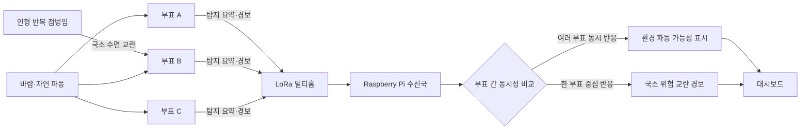
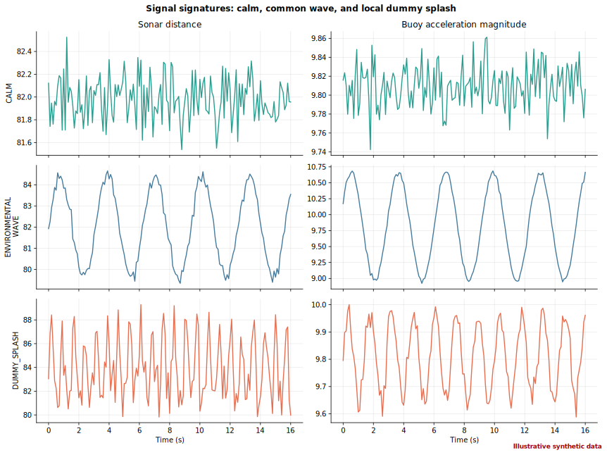
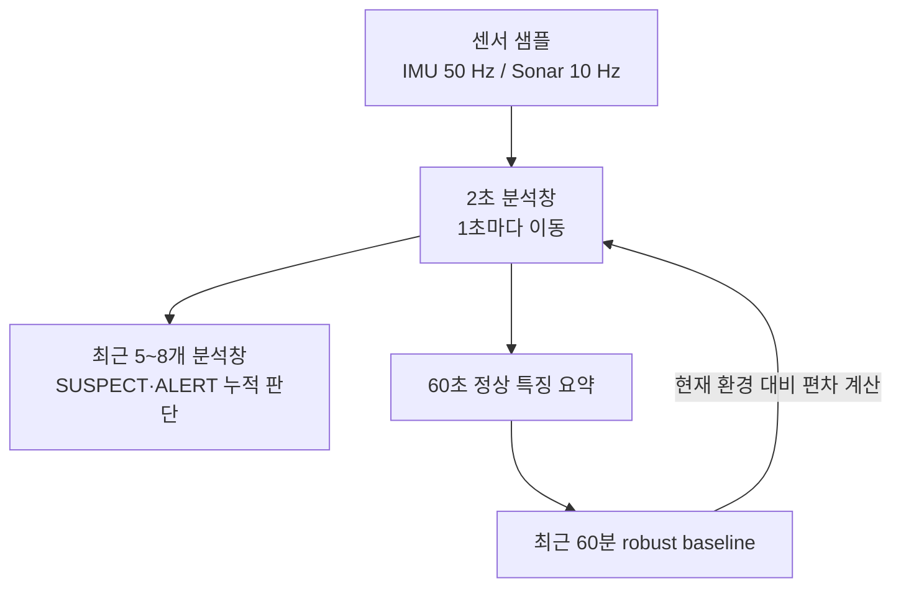
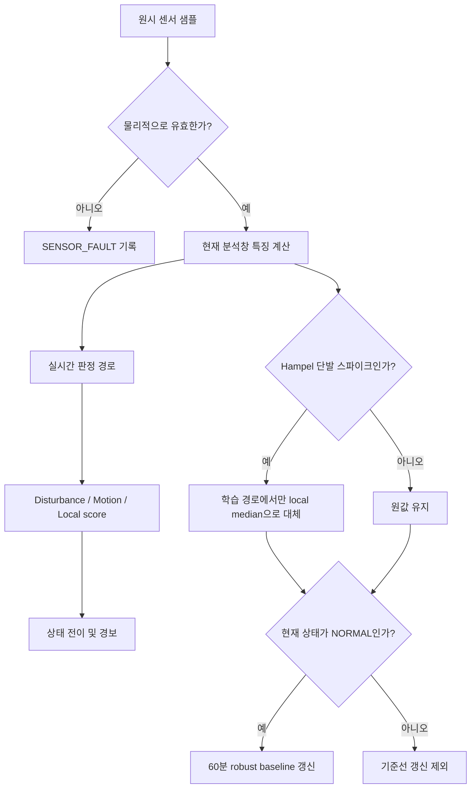
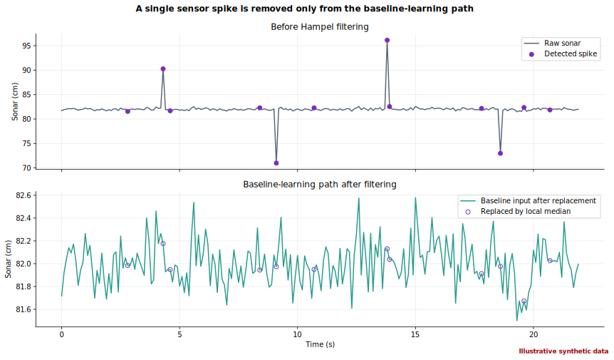
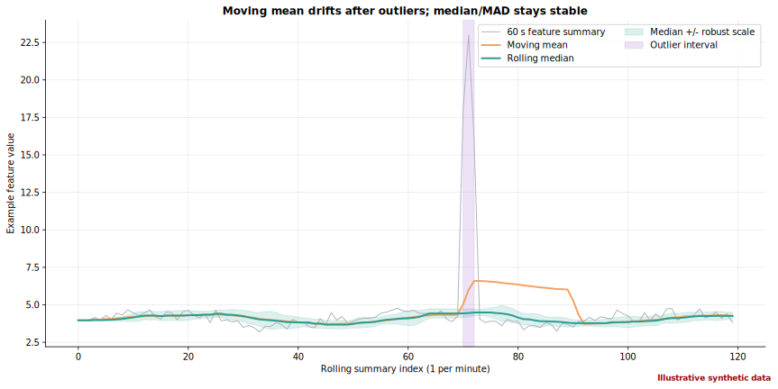
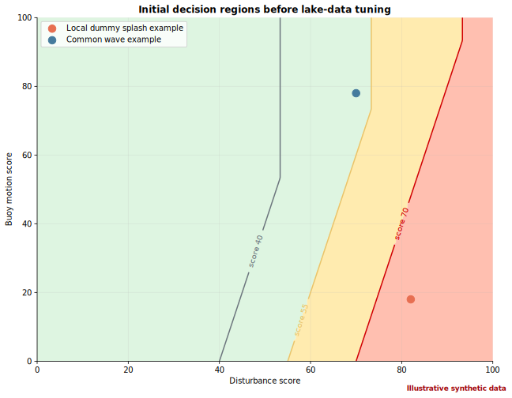
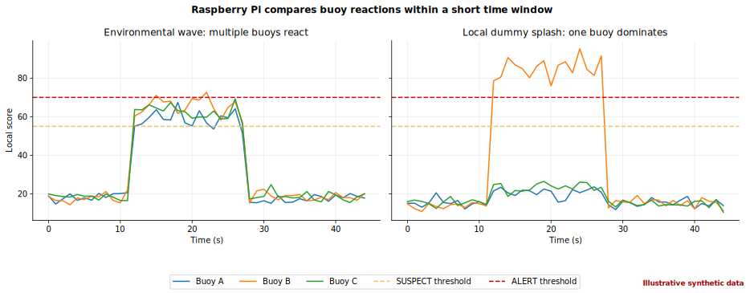
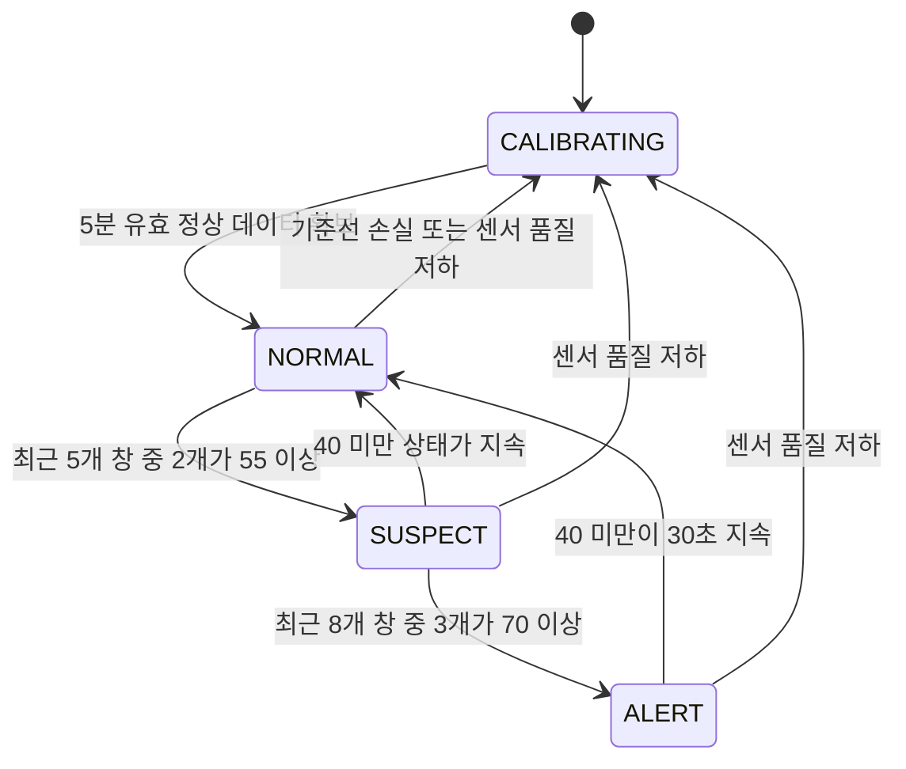
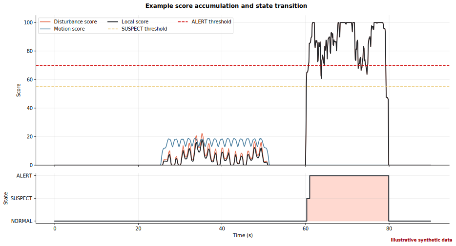

# 얕은 호수 인형 시연용 위험 수면 교란 감지 설계

> **중요한 해석 범위**
>
> 이 설계가 감지하는 대상은 실제 익수자 자체가 아니라, **부표 근처에서 인형의 반복 첨벙임으로 재현한 국소 위험 수면 교란**이다.
> 인형은 실제 사람의 익수 행동, 호흡 상태, 자발적 움직임을 재현하지 못한다. 따라서 실험 결과를 “익수자 감지 정확도”로 표현하지 않고,
> **“인형 첨벙임 시나리오 탐지율”**로 표현한다. 경보는 구조 판단을 대신하지 않으며 현장 담당자의 확인이 필요하다.

## 1. 문서 목적

이 문서는 팀원과 평가자가 다음 질문에 같은 답을 가질 수 있도록 작성한다.

1. 자연 파동으로 부표 전체가 흔들리는 경우와, 한 부표 근처에서 인형이 반복적으로 첨벙이는 경우를 어떻게 구별하는가?
2. 이동평균에 센서 오류나 강한 사건 값이 섞여 기준선이 왜곡되는 문제를 어떻게 줄이는가?
3. 1시간 기준선을 사용하면서도 어떻게 10~20초 안에 위험 교란을 알리는가?
4. 얕은 호수 실험에서 어떤 데이터를 수집하고 어떤 지표로 성공 여부를 판단하는가?

현재 문서의 그래프는 별도 표시가 없는 한 **알고리즘 설명용 합성 예시 데이터**이다. 실제 호수 측정 결과가 아니다.
실측 이후 [`generate_detection_graphs.py`](./generate_detection_graphs.py)에 CSV를 입력하여 같은 형식의 그래프로 교체한다.

---

## 2. 실험 환경과 판정 의미

### 2.1 고정 조건

| 항목 | 설계 조건 |
| --- | --- |
| 장소 | 수심이 얕고 안전요원이 접근 가능한 호수 |
| 부표 수 | 3개 |
| 위험 교란 재현 | 부표 근처에서 인형을 반복적으로 첨벙이게 함 |
| 초음파 센서 | JSN-SR04T, 수면 위에서 아래 방향으로 수면까지 거리 측정 |
| IMU | MPU-6050, 부표 자체의 가속도와 회전 측정 |
| 통신 | 부표 간 LoRa pub/sub 및 Raspberry Pi 수신국 |
| 목표 경보 지연 | 위험 교란 시작 후 10~20초 이내 |

### 2.2 라벨 정의

| 라벨 | 의미 | 기준선 학습 포함 여부 |
| --- | --- | --- |
| `CALM` | 정수면 또는 매우 작은 정상 흔들림 | 포함 |
| `ENVIRONMENTAL_WAVE` | 바람이나 주변 환경 때문에 여러 부표가 함께 반응하는 파동 | 조건부 포함 |
| `DUMMY_SPLASH` | 한 부표 근처에서 인형의 반복 첨벙임으로 만든 국소 교란 | 제외 |
| `SENSOR_FAULT` | timeout, 물리 범위 초과, 단발 스파이크 등 측정 오류 | 제외 |

`ENVIRONMENTAL_WAVE`는 정상 운용 중 흔히 존재하므로 장기적으로 기준선에 일부 반영할 수 있다. 다만 매우 강한 파동 구간은 기준선을 갑자기
높이지 않도록 갱신에서 제외한다.

### 2.3 시스템 경보가 의미하는 것

대시보드의 `ALERT`는 다음 문장으로 해석한다.

> “부표 주변에서 평소 환경 파동과 다른 국소 위험 교란이 반복적으로 관측되었다. 현장 확인이 필요하다.”

이 경보만으로 실제 익수 여부를 확정하지 않는다. 움직임 없이 잠기는 실제 익수, 부표 감지 범위 밖의 사고, 인형과 사람의 동작 차이는 이번
프로토타입의 한계이다.

---

## 3. 전체 시스템 개념

### 3.1 얕은 호수 배치와 데이터 흐름



핵심 구분 기준은 **초음파 변화량 자체의 크기만이 아니다**.

- 환경 파동: 초음파 거리 변화와 함께 부표 IMU 움직임도 커지고, 여러 부표가 비슷한 시간에 반응할 가능성이 높다.
- 인형 국소 첨벙임: 가까운 부표의 초음파 변화가 강하지만, 해당 부표의 전체 운동과 이웃 부표 반응은 상대적으로 작을 가능성이 높다.



> 위 그래프는 실제 측정 결과가 아닌 **합성 예시 데이터**이다. 왼쪽은 초음파 거리, 오른쪽은 부표 가속도 크기이다.
> 환경 파동은 두 센서가 함께 변하지만, 국소 첨벙임은 초음파 변화가 상대적으로 두드러지는 상황을 설명한다.

---

## 4. 왜 1시간 평균만으로 판정하지 않는가

익수 위험 교란은 빠르게 알려야 한다. 1시간 평균만 사용하면 짧은 사건이 평균에 묻히고 경보가 지나치게 늦어진다. 반대로 아주 짧은 창만
사용하면 자연 파동이나 센서 오류를 위험 사건으로 오인하기 쉽다.

따라서 시스템은 서로 목적이 다른 세 가지 시간 규모를 함께 사용한다.



| 시간 규모 | 역할 |
| --- | --- |
| 센서 샘플 | 짧은 충격과 회전을 놓치지 않음 |
| 2초 분석창, 1초 이동 | 현재 수면·부표 움직임의 특징 계산 |
| 최근 5~8개 창 | 한 번의 튐이 아니라 반복되는 위험 후보인지 판단 |
| 60초 정상 특징 요약 | 장기 기준선에 저장할 데이터 크기를 줄임 |
| 최근 60분 기준선 | 현재 호수의 평상시 파동 수준에 적응 |

---

## 5. 판정 경로와 기준선 학습 경로의 분리

센서 오류를 제거하는 과정에서 실제 인형 첨벙임까지 “이상치”라며 삭제하면 탐지 시스템의 목적을 잃는다. 따라서 같은 센서 샘플을 두 경로로
분리한다.



### 5.1 물리 유효성 검사

다음 값은 특징 계산 전에 `SENSOR_FAULT`로 처리한다.

- 초음파 timeout 또는 센서가 지원하는 물리 거리 범위 밖의 값
- `NaN`, 무한대, 패킷 파싱 오류
- IMU가 반환할 수 없는 비정상 범위
- 설정된 시간 간격보다 지나치게 늦거나 역순인 샘플

정확한 물리 범위는 실제 설치 높이와 센서 데이터시트를 확인한 뒤 설정한다.

### 5.2 Hampel 필터

단발 초음파 스파이크는 최근 7개 샘플의 중앙값과 MAD(Median Absolute Deviation)를 사용하여 찾는다.

```text
local_median = median(window)
MAD          = median(|x_i - local_median|)
robust_sigma = max(1.4826 × MAD, epsilon)

outlier if |x - local_median| > 3.5 × robust_sigma
```

- `1.4826 × MAD`는 정규분포의 표준편차 규모와 비교하기 위한 보정값이다.
- `epsilon`은 모든 값이 같아 `MAD = 0`이 되는 경우 0으로 나누는 문제를 막는다.
- 단발 스파이크는 **기준선 학습 경로에서만** 중앙값으로 대체한다.
- 연속 스파이크나 초음파·IMU에서 동시에 나타난 큰 변화는 실제 사건일 수 있으므로 실시간 판정 경로에 남긴다.



> 위 그래프는 실제 측정 결과가 아닌 **합성 예시 데이터**이다. 자주 발생하지 않는 단발 측정 오류가 장기 기준선을 흔들지 않도록 하는
> 원리를 보여준다. 위험 후보까지 지우는 필터로 사용해서는 안 된다.

---

## 6. 2초 분석창에서 계산하는 특징

센서마다 단위와 의미가 다르므로 원시값을 바로 더하지 않고, 2초 분석창마다 특징을 계산한다.

### 6.1 초음파 수면 교란 특징

| 특징 | 의미 |
| --- | --- |
| 거리 잔차 RMS | 평상시 수면 거리에서 얼마나 크게 벗어나는가 |
| 최대-최소 거리 | 분석창 안에서 수면 높이 범위가 얼마나 큰가 |
| 거리 변화 속도 RMS | 수면이 얼마나 빠르게 움직이는가 |
| 측정 실패율 | 물방울, 반사 실패, 센서 각도 문제 가능성 |

초음파 센서가 부표와 함께 움직이므로 거리 변화만으로 실제 수면 움직임을 확정할 수 없다. 반드시 IMU 특징과 함께 해석한다.

### 6.2 IMU 부표 운동 특징

| 특징 | 의미 |
| --- | --- |
| `|accel| - g` RMS | 중력 크기에서 벗어난 부표 가속 운동 |
| jerk RMS | 가속도가 얼마나 급격히 변하는가 |
| 자이로 회전량 RMS | 부표의 기울기·회전 변화 |

현재 펌웨어는 가속도 크기 하나만 사용한다. 실제 구현 단계에서는 MPU-6050의 3축 가속도와 3축 자이로 값을 모두 보존해야 한다.

---

## 7. 60분 robust baseline

### 7.1 평균의 평균 대신 median과 MAD를 사용하는 이유

단순 이동평균은 큰 이상치가 들어온 뒤 일정 시간 동안 함께 끌려간다. 그 결과 실제 위험 사건이 발생해도 “이미 기준선이 높다”고 판단하여
놓칠 수 있다.

이 설계는 정상 상태의 60초 특징 요약을 최대 60개 보관하고 다음 값을 계산한다.

```text
baseline_center = median(last_60_normal_summaries)
baseline_scale  = max(1.4826 × MAD(last_60_normal_summaries), epsilon)
```



> 위 그래프는 실제 측정 결과가 아닌 **합성 예시 데이터**이다. 보라색 이상 구간 뒤에 이동평균은 크게 흔들리지만, 중앙값과 MAD 기반
> 기준선은 정상 구간 중심을 비교적 안정적으로 유지한다.

### 7.2 기준선 갱신 규칙

- 부팅 후 최초 5분은 `CALIBRATING`으로 표시하고 정상 수면 데이터를 모은다.
- `NORMAL` 상태이고 센서 품질이 정상일 때만 기준선을 갱신한다.
- `DUMMY_SPLASH`, `SUSPECT`, `ALERT`, `SENSOR_FAULT` 구간은 기준선에서 제외한다.
- 강한 `ENVIRONMENTAL_WAVE` 구간도 갑작스러운 기준선 상승을 막기 위해 제외한다.
- 기준선 샘플이 부족하면 confidence를 낮추고 `CALIBRATING` 상태를 유지한다.

---

## 8. 점수 융합과 초기 판정식

모든 임계값과 가중치는 **호수 실측 전 초기 튜닝값**이다. 고정된 과학적 상수가 아니며 라벨 데이터로 조정해야 한다.

### 8.1 Robust z-score

각 특징이 최근 60분 기준선에서 얼마나 벗어났는지 계산한다.

```text
feature_z = max(0, |current_feature - baseline_center| / baseline_scale - 1)
```

초기 구현에서는 초음파 특징 중 가장 큰 편차를 `disturbance_score`, IMU 특징 중 가장 큰 편차를 `motion_score`로 변환한다.

### 8.2 Local score

```text
local_score =
    0.75 × disturbance_score
  + 0.25 × max(0, disturbance_score - motion_score)
```

- 수면 교란 자체를 우선하므로 `disturbance_score` 비중을 크게 둔다.
- 초음파 교란에 비해 부표 전체 운동이 작으면 국소 교란 가능성을 추가한다.
- 초음파와 부표가 함께 크게 움직이는 경우에는 환경 파동 가능성이 높아 추가 점수가 작아진다.



> 위 그래프는 실제 측정 결과가 아닌 **합성 개념도**이다. 실제 호수 데이터가 쌓이면 임계선과 가중치를 혼동행렬 기준으로 조정한다.

### 8.3 여러 부표의 동시성 보정

Raspberry Pi는 최근 15초 동안 세 부표의 점수를 비교한다.

- ±5초 안에 2개 이상 부표의 `motion_score`가 높으면 공통 환경 파동 가능성을 표시한다.
- 한 부표만 높은 `disturbance_score`를 반복적으로 보이고 이웃 부표는 정상이라면 국소 교란 confidence를 높인다.
- 이웃 부표 데이터가 없으면 로컬 판정을 유지하되 품질 경고를 함께 표시한다.



> 위 그래프는 실제 측정 결과가 아닌 **합성 예시 데이터**이다. 자연 파동은 여러 부표가 함께 반응하고, 인형 국소 첨벙임은 가까운 부표가
> 주로 반응한다는 설계 가설을 표현한다. 실제 배치 간격과 파장에 따라 이 가설은 반드시 현장에서 검증해야 한다.

---

## 9. 상태 전이

한 번의 큰 값으로 즉시 경보를 발생시키지 않고 최근 분석창에서 위험 점수가 반복되는지 확인한다.



| 상태 | 사용자에게 보이는 의미 |
| --- | --- |
| `CALIBRATING` | 기준선 학습 중 또는 센서 품질 부족 |
| `NORMAL` | 현재 기준선 범위의 수면 상태 |
| `SUSPECT` | 반복되는 국소 위험 교란 후보 |
| `ALERT` | 확인이 필요한 강한 국소 위험 교란 |



> 위 그래프는 실제 측정 결과가 아닌 **합성 예시 데이터**이다. 임계값을 잠깐 넘는 신호보다 반복적으로 누적되는 신호를 우선한다.

---

## 10. 초기 튜닝값 요약

| 파라미터 | 초기값 | 목적 |
| --- | ---: | --- |
| IMU 샘플링 | 50 Hz | 짧은 충격·회전 포착 |
| 초음파 샘플링 | 10 Hz | 수면 거리 변화 포착 |
| 특징 분석창 | 2초 | 짧은 사건 특징 계산 |
| 분석창 이동 간격 | 1초 | 빠른 갱신 |
| Hampel 창 | 최근 7개 샘플 | 단발 스파이크 식별 |
| Hampel 임계값 | `3.5 × robust_sigma` | 기준선 오염 방지 |
| 초기 기준선 학습 | 5분 | 시연 준비시간과 안정성 절충 |
| 장기 기준선 | 최근 60분 정상 요약 | 환경 적응 |
| `SUSPECT` | 최근 5개 창 중 2개가 55 이상 | 반복 후보 감지 |
| `ALERT` | 최근 8개 창 중 3개가 70 이상 | 강한 반복 교란 경보 |
| 경보 해제 | 40 미만이 30초 지속 | 상태 깜빡임 방지 |

이 값들은 코드에 박아 두고 끝내는 값이 아니다. 실제 호수 데이터의 탐지율, 오경보율, 탐지 지연을 비교하여 변경 이력을 기록해야 한다.

---

## 11. 얕은 호수 데이터 수집 계획

### 11.1 안전 및 설치 확인

1. 안전요원, 인형 회수용 줄, 구명 장비, 방수 상태를 확인한다.
2. 초음파 센서가 정상 수면을 안정적으로 읽는 설치 높이와 각도를 찾는다.
3. 부표 주변 여러 거리에서 첨벙임을 만들고 초음파가 실제로 반응하는 유효 감지 범위를 기록한다.
4. 세 부표의 간격과 위치를 기록한다. 가능하면 사진 또는 지도 좌표도 함께 보존한다.
5. 시험 시작 전 부표 시계를 동기화하거나 Raspberry Pi 수신 시각을 기준으로 라벨 시간을 맞춘다.

### 11.2 필수 수집 시나리오

| 시나리오 | 최소 수집량 | 변화 조건 | 라벨 |
| --- | ---: | --- | --- |
| 정수면·약한 자연 흔들림 | 60분 | 시간대 또는 바람 변화 포함 | `CALM` |
| 자연 파동 | 60분 | 가능한 범위에서 파동 세기 변화 | `ENVIRONMENTAL_WAVE` |
| 인형 반복 첨벙임 | 30회 | 약·중·강 세기, 부표와의 거리 변화 | `DUMMY_SPLASH` |
| 센서 오류 확인 | 발생 시마다 | timeout, 물방울, 순간 반사 실패 | `SENSOR_FAULT` |

비, 보트 파동, 새나 떠다니는 물체 등은 가능할 때 별도 조건 메모를 추가한다. 데이터가 충분히 쌓이면 새로운 라벨로 분리할 수 있다.

### 11.3 한 번의 인형 실험 기록

각 실험은 다음 메타데이터를 남긴다.

```text
trial_id: DUMMY_SPLASH_001
start_timestamp_ms: ...
end_timestamp_ms: ...
nearest_buoy: B
distance_to_buoy_m: ...
intensity: weak | medium | strong
operator_note: 줄을 이용해 15초간 반복 첨벙임
weather_note: ...
```

인형 실험 시작·종료 구간은 기준선 학습에서 반드시 제외한다.

---

## 12. 검증 지표와 합격 기준

### 12.1 혼동행렬

이번 실험의 양성은 `DUMMY_SPLASH`, 음성은 `CALM + ENVIRONMENTAL_WAVE`로 정의한다.

|  | 시스템 경보 | 시스템 정상 |
| --- | ---: | ---: |
| 실제 `DUMMY_SPLASH` | TP | FN |
| 실제 정상·환경 파동 | FP | TN |

```text
인형 첨벙임 탐지율 = TP / (TP + FN)
정밀도             = TP / (TP + FP)
```

한 실험에서 여러 개의 경보가 발생하더라도 첫 경보 하나를 해당 실험의 탐지 결과로 계산한다. 같은 사건의 중복 경보가 탐지율을 부풀리지 않게
하기 위함이다.

### 12.2 탐지 지연

```text
탐지 지연 = 최초 ALERT 시각 - 라벨된 첨벙임 시작 시각
```

`SUSPECT` 시각도 별도로 기록하되, 목표 지연 평가는 `ALERT` 기준으로 계산한다.

### 12.3 오경보율

```text
오경보율 = 정상·환경 파동 구간의 독립 ALERT 수 / 해당 구간 운용 시간
```

경보가 유지되는 동안 반복 전송된 패킷은 하나의 오경보 사건으로 계산한다.

### 12.4 합격 기준

- 인형 첨벙임 실험의 **90% 이상**을 감지한다.
- 최초 `ALERT`가 첨벙임 시작 후 **20초 이내** 발생한다.
- `CALM + ENVIRONMENTAL_WAVE` 구간의 오경보는 **30분당 1회 미만**이다.
- 센서 품질이 나쁠 때 위험 경보를 임의 생성하지 않고 `CALIBRATING` 또는 오류 상태를 표시한다.

합격 기준을 만족해도 실제 익수자 탐지 성능을 증명한 것은 아니다.

---

## 13. 실측 CSV와 그래프 재생성

### 13.1 CSV 스키마

CSV는 다음 열을 정확히 포함한다.

| 열 | 형식 | 설명 |
| --- | --- | --- |
| `timestamp_ms` | 정수 또는 실수 | 실험 공통 기준의 밀리초 시각 |
| `buoy_id` | 문자열 | `A`, `B`, `C` 등 부표 식별자 |
| `sonar_cm` | 실수 | 수면까지 초음파 거리 |
| `accel_mag_ms2` | 실수 | 가속도 크기 |
| `gyro_mag_rads` | 실수 | 자이로 회전량 크기 |
| `label` | 문자열 | 정의된 네 라벨 중 하나 |

예시:

```csv
timestamp_ms,buoy_id,sonar_cm,accel_mag_ms2,gyro_mag_rads,label
0,B,82.1,9.80,0.012,CALM
100,B,82.0,9.82,0.011,CALM
200,B,87.4,9.91,0.043,DUMMY_SPLASH
```

### 13.2 합성 그래프 재생성

저장소 루트에서 실행한다.

```powershell
python docs/generate_detection_graphs.py
```

고정 random seed를 사용하므로 실행할 때마다 같은 합성 예시 SVG가 생성된다.

### 13.3 실측 CSV 적용

```powershell
python docs/generate_detection_graphs.py --csv path/to/lake_measurements.csv
```

여러 부표가 들어 있는 CSV는 기본적으로 정렬상 첫 번째 부표를 사용한다. 특정 부표를 선택하려면 다음처럼 실행한다.

```powershell
python docs/generate_detection_graphs.py --csv path/to/lake_measurements.csv --buoy-id B
```

실측 CSV를 사용하면 충분한 측정 데이터가 있는 시계열 그래프에 `Measured CSV data`가 표시된다. 판정 영역과 다중 부표 개념도처럼
알고리즘 자체를 설명하는 그래프는 계속 합성 개념도로 유지된다. 라벨별 샘플이나 측정 시간이 부족해 합성 예시로 대체된 그래프에는
`Illustrative synthetic data`가 표시되므로, 발표 전에 각 SVG의 하단 표기를 반드시 확인한다.

필요 패키지:

```text
numpy
matplotlib
```

문서 전용 의존성은 다음 명령으로 설치할 수 있다.

```powershell
python -m pip install -r docs/requirements.txt
```

---

## 14. 기존 캡스톤 경험에서 가져온 것과 바꾼 것

첨부된 태양광 모바일 블록체인 캡스톤 프로젝트는 ESP32가 3초마다 전력 데이터를 전송하고, 브리지 서버가 장치별 상태를 관리하면서 물리적으로
불가능한 값과 임계값 도달 이벤트를 처리한다. 이번 설계는 그 경험을 다음처럼 계승한다.

| 캡스톤에서 얻은 설계 경험 | 이번 시스템 적용 |
| --- | --- |
| `device_id`별 상태를 독립 관리 | 부표별 기준선과 최근 상태를 독립 관리 |
| 물리 범위 밖의 전력값을 즉시 제외 | timeout과 물리 범위 밖 센서값을 `SENSOR_FAULT` 처리 |
| 누적값이 임계값에 도달하면 이벤트 전송 | 반복 분석창 점수가 조건을 만족하면 경보 전송 |
| 센서 장치와 서버의 역할 분리 | 부표의 빠른 후보 판정과 Pi의 다중 부표 보정 분리 |

태양광 프로젝트의 `0 < power < 10000` 같은 고정 범위 검사는 명백한 센서 오류를 막는 데는 유효하지만, 호수 파동처럼 정상 범위가 계속
변하는 데이터의 위험 여부를 판정하기에는 부족하다. 따라서 이번 설계에서는 **물리 범위 검사는 센서 오류 제거에만 사용**하고,
위험 교란 판정에는 최근 60분의 median/MAD 기준선을 사용한다.

## 15. 외부 자료가 뒷받침하는 설계 근거

외부 자료는 이 프로토타입의 방향을 뒷받침하지만, 현재 센서 구성이 실제 익수자를 정확히 판별한다고 증명하지는 않는다.

| 자료 | 이번 설계에 적용한 근거 |
| --- | --- |
| [The Visible Behaviour of Drowning Persons](https://www.mdpi.com/1660-4601/17/18/6930) | 익수 행동은 다양하고 관찰 사례가 빠르게 진행되므로, 1시간 평균이 아닌 짧은 실시간 분석창이 필요하다. 동시에 인형 첨벙임만으로 실제 익수 행동을 대표할 수 없다는 한계를 명확히 해야 한다. |
| [U.S. CPSC Swimming Pool Alarm Evaluation](https://www.poolsafely.gov/wp-content/uploads/2016/04/alarm.pdf) | 수면 교란 경보기는 오경보와 누락 가능성이 있어 단독 안전장치가 아닌 추가 확인 수단으로 사용해야 한다. |
| [The Accelerations of a Wave Measurement Buoy Impacted by Breaking Waves](https://www.mdpi.com/2077-1312/9/2/214) | 파동·충격의 특징은 충분한 속도의 IMU 시계열에서 나타나므로 현재 3초 단일 측정보다 높은 샘플링과 분석창 특징이 필요하다. |
| [NIST Measures of Scale](https://www.itl.nist.gov/div898/handbook/eda/section3/eda356.htm) | 비정규 분포와 긴 꼬리 데이터에서는 표준편차보다 median absolute deviation 같은 robust scale 사용이 합리적이다. |

따라서 발표에서는 “외부 연구로 익수 판별 정확도가 증명되었다”고 말하지 않는다. 대신 “외부 자료가 알려주는 수면 감지의 한계와 robust
통계 원칙을 반영하여, 얕은 호수 인형 시연에 맞는 검증 가능한 위험 교란 감지 기준을 설계했다”고 설명한다.

## 16. 구현 시 지켜야 할 원칙

1. `DUMMY_SPLASH`를 실제 익수자와 동일시하지 않는다.
2. 단발 이상치를 기준선에서 제외하더라도 실시간 판정 경로에서는 원신호를 보존한다.
3. `SUSPECT`와 `ALERT` 상태의 데이터로 기준선을 학습하지 않는다.
4. 임계값과 가중치는 호수 라벨 데이터와 함께 변경 이유를 기록한다.
5. 센서 하나의 값만으로 확정 경보를 설명하지 않고, 초음파·IMU·다중 부표 근거를 함께 표시한다.
6. 탐지율뿐 아니라 오경보율과 탐지 지연을 동시에 보고한다.

## 17. 알려진 한계와 후속 확장

- 수면 위 초음파 센서는 빗방울, 물방울 부착, 센서 기울기, 반사 각도에 영향을 받는다.
- 여러 부표가 동시에 반응한다는 이유만으로 항상 자연 파동인 것은 아니다. 큰 국소 충격이 이웃 부표까지 전파될 수 있다.
- 움직임 없이 잠기는 실제 익수는 현재 방식으로 감지하지 못할 수 있다.
- 인형의 부력, 크기, 줄을 당기는 방식은 실제 사람 움직임과 다르다.
- 실제 안전 시스템으로 확장하려면 수중 센서, 카메라, 웨어러블 또는 안전요원 관측과 결합해야 한다.

이번 프로토타입의 가치는 위 한계를 숨기는 데 있지 않다. 제한된 센서와 LoRa 환경에서 **설명 가능하고 검증 가능한 위험 교란 감지
파이프라인**을 설계하고, 라벨 데이터로 그 성능과 한계를 정량화하는 데 있다.
