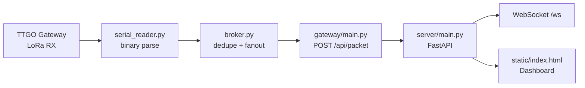

# Raspberry Pi Gateway Server

LoRa 수신 게이트웨이 TTGO에서 넘어온 binary Serial 패킷을 Raspberry Pi가 읽고, 내부 broker를 거쳐 FastAPI 서버와 WebSocket 대시보드로 전달하는 애플리케이션입니다.

## 전체 흐름



## 구성

| 경로 | 역할 |
| --- | --- |
| `gateway/serial_reader.py` | Serial stream에서 LoRa binary packet 파싱 |
| `gateway/broker.py` | `(node_id, msg_id)` 중복 억제와 subscriber fanout |
| `gateway/main.py` | broker packet을 서버 `/api/packet`으로 HTTP forward |
| `gateway/lib/packet.py` | LoRa packet model과 enum |
| `server/main.py` | FastAPI REST API, WebSocket, mock seed, recording 제어 |
| `server/state.py` | 부표 상태, relay-only 상태, event 생성 |
| `server/ml_inference.py` | 실시간 ML inference |
| `server/recorder.py` | 대시보드 Start CSV/Stop 기록 |
| `server/static/index.html` | 실시간 웹 대시보드 |
| `tests` | gateway, server, ML inference 단위 테스트 |

## 설치

Python 3.11 이상이 필요합니다.

```bash
cd rpi-gateway-server
chmod +x setup.sh run.sh
./setup.sh
```

## 실행

실제 게이트웨이 TTGO가 연결된 경우:

```bash
cd rpi-gateway-server
SERIAL_PORT=/dev/ttyACM0 BAUD_RATE=115200 MOCK_DATA=0 ./run.sh
```

하드웨어 없이 대시보드만 확인하는 경우:

```bash
cd rpi-gateway-server
MOCK_DATA=1 ./run.sh
```

접속 주소:

```text
http://localhost:8000
```

## 주요 환경 변수

| 변수 | 기본값 | 설명 |
| --- | --- | --- |
| `SERIAL_PORT` | `/dev/ttyACM0` | 게이트웨이 TTGO Serial port |
| `BAUD_RATE` | `115200` | Serial baud rate |
| `SERVER_HOST` | `0.0.0.0` | FastAPI bind host |
| `SERVER_PORT` | `8000` | FastAPI port |
| `MOCK_DATA` | `0` in `run.sh` | mock 부표 상태 seed 여부 |
| `ML_MODEL_PATH` | repo root의 `detection_ml_v1/models/bath_accel_only_v2/model.joblib` | 실시간 판별 모델 |
| `ML_SUSPECT_THRESHOLD` | `0.30` | DUMMY_SPLASH 확률 기반 SUSPECT threshold |
| `SONAR_DISTANCE_THRESHOLD_CM` | `25` | sonar 근접 rule threshold |

## API

| Method | Path | 설명 |
| --- | --- | --- |
| `GET` | `/` | 대시보드 HTML |
| `POST` | `/api/packet` | gateway가 LoRa packet을 전달 |
| `GET` | `/api/buoys` | 현재 부표 상태 |
| `GET` | `/api/events` | 최근 이벤트 목록 |
| `GET` | `/api/recording` | CSV 기록 상태 |
| `POST` | `/api/recording/start` | CSV 기록 시작 |
| `POST` | `/api/recording/stop` | CSV 기록 중지 |
| `GET` | `/api/ml` | ML 모델 상태 |
| `WS` | `/ws` | 대시보드 실시간 push |

## 테스트

```bash
cd rpi-gateway-server
source .venv/bin/activate
python -m pytest tests
```

## 운영 메모

- `run.sh`는 server와 gateway 프로세스를 함께 띄우고, 한쪽이 종료되면 나머지도 정리합니다.
- 대시보드의 `Start CSV`와 `Stop`으로 저장한 CSV는 기본적으로 `server/recordings` 아래에 생성됩니다.
- 서버는 ML 예측과 sonar 근접 rule을 함께 사용해 `NORMAL`, `SUSPECT`, `ALERT` 상태를 갱신합니다.
